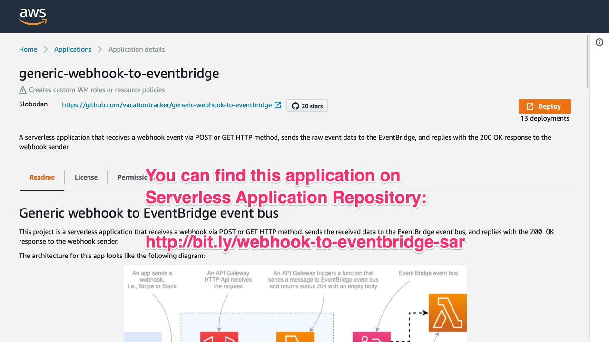

Welcome to Five Minutes Serverless!

---


In this episode, we will build a Stripe events processor using AWS SAM, EventBridge, and TypeScript.

---


As you probably know, Stripe is one of the most popular payment processors. Many of us use it in our applications.

(pause: 1)

Stripe has an excellent API, and it can send us events using webhooks.

For example, it can notify us when it generates a new invoice or process a payment.

---


In this video, we'll build a serverless application that receives webhook events from Stripe and sends them to the EventBridge event bus for further processing.

---

(font-size: 42)

```md
**Prerequisites:**

- An active AWS account
- AWS SAM installed
- Node.js version 8+ (version 12 is recommended)
- Stripe dev account
```

Before we begin, make sure you have the following prerequisites.

(duration: 5)

---

```bash
mkdir stripe-events
cd stripe-events
```

Let's start by creating a new folder. Feel free to pick the name you like. We'll call it "stripe-events."

(pause: 1)

Then navigate to your new folder using your terminal.

---

(font-size: 40)

```bash
sam init --location gh:serverlesspub/sam-ts
```

You can initialize an AWS SAM project by running the following command from your new folder using your terminal.

---


This command will create a new AWS SAM project with a Hello World function written in TypeScript.

---

```bash
npm install
npm run build
sam deploy --guided
```

Let's try to build and deploy this project to confirm that everything works as expected.

(pause: 1)

To build a project, run the "npm run build" command from your project folder in your terminal.

(pause: 1)

Then run the "aws sam --guided" command to deploy the SAM project to your AWS account.

---

(font-size: 42)

```bash
version = 0.1
[default]
[default.deploy]
[default.deploy.parameters]
stack_name = "stripe-events"
s3_bucket = "aws-sam-cli-managed-..."
s3_prefix = "stripe-events"
region = "us-east-1"
capabilities = "CAPABILITY_IAM"
```

SAM will guide you through the deployment process and create the "samconfig.toml" file with your deployment configuration.

(pause: 1)

The SAM config file will look similar to the file you see right now.

---

(font-size: 36)

```bash
capabilities = "CAPABILITY_IAM CAPABILITY_AUTO_EXPAND"
```

As we'll use Serverless Application Repository in a minute, let's edit the SAM config file.

(pause: 1)

Add CAPABILITY _ AUTO _ EXPAND to the list of capabilities, to allow SAM to deploy SAR apps.

---


Now that everything is ready, let's build our application.

---

(callout:
  cx: 838
  cy: 346
  size: 100)


(transition: crossfade 1)

First, create an EventBridge event bus.

---

```yaml
PaymentEventBus:
  Type: AWS::Events::EventBus
  Properties:
      Name: StripeEventBus
```

To do so, add the following code to the Resources section of your template.yaml file.

---


---

(callout:
  type: rectangle
  left: 310
  top: 225
  right: 723
  bottom: 468)


(transition: crossfade 1)

Then, add the generic webhook to EventBridge application from Serverless Application Repository.

---



You can find the Generic webhook to EventBridge application on Serverless Application Repository.

---

(font-size: 36)

```yaml
StripeWebhook:
  Type: AWS::Serverless::Application
  Properties:
    Location:
      ApplicationId: arn:aws:serverlessrepo:
        us-east-1:721177882564:applications/
        generic-webhook-to-eventbridge
      SemanticVersion: 1.3.4
    Parameters:
      EventBusName: !Ref PaymentEventBus
      EventSource: stripe-events
```

You can also add SAR app by adding the following code to the Resources section of your template file.

---


---

(callout:
  cx: 1050
  cy: 346
  size: 100)


(transition: crossfade 1)

Finally, create a Lambda function to handle Stripe event.

---

(font-size: 32)

```yaml
ChargeSucceededProcessor:
  Type: AWS::Serverless::Function
  Properties:
    CodeUri: build/charge-processor
    Handler: lambda.handler
    Events:
      OnChargeSucceeded:
        Type: CloudWatchEvent
        Properties:
          EventBusName: !Ref PaymentEventBus
          Pattern:
            detail:
              body:
                type:
                - charge.succeeded
```

Add the following code to the Resources section of your template file.

---

```yaml
OnChargeSucceeded:
  Type: CloudWatchEvent
  Properties:
    EventBusName: !Ref PaymentEventBus
    Pattern:
      detail:
        body:
          type:
          - charge.succeeded
```

The most interesting part of our function is the event.

(pause: 1)

This tells EventBridge to run our function only when it receives the event with charge succeeded type in event body.

(pause: 1)

We are also using the CloudWatchEvent as a trigger type because CloudWatch events are now part of EventBridge, and SAM does not have a separate EventBrige trigger type at the moment.

---

(font-size: 32)

```yaml
Outputs:
  StripeWebhookUrl:
    Description: Webhook URL
    Value: !GetAtt StripeWebhook.Outputs.WebhookApiUrl

  ChargeSucceededProcessor:
    Description: Function logical ID
    Value: !Ref ChargeSucceededProcessor
```

At the bottom of your template file, add the following snippet to export the webhook URL and function logical ID.

(pause: 1)

We need the webhook URL for Stripe, and function logical ID to be able to read logs using SAM.

---

(font-size: 26)

```typescript
// Allow CloudWatch to read source maps
import 'source-map-support/register'

// Import event types from @types/aws-lambda
import { ScheduledEvent } from 'aws-lambda'

// Export handler function
export async function handler(event: ScheduledEvent): Promise<number> {
  // Log the event
  console.log(event)
  return true
}
```

The next step is to create a Lambda function code.

Create the "charge-processor" folder in the source folder, and create the "lambda.ts" file inside with the following content.

(pause: 1)

Let's analyze it line by line.

---

(font-size: 32)

```typescript
// Allow CloudWatch to read source maps
import 'source-map-support/register'
```

At the top of the lambda.ts file, add source map support. Without this line, CloudWatch would not be able to show human-readable error stack traces.

---

(font-size: 32)

```typescript
// Import event types from @types/aws-lambda
import { ScheduledEvent } from 'aws-lambda'
```

Then import the type from the "aws-lambda" module.

We use the "ScheduledEvent" because that's the trigger type for the CloudWatch Events and EventBridge triggers.

---

(font-size: 23)

```typescript
// Export handler function
export async function handler(event: ScheduledEvent): Promise<number> {
  // Log the event
  console.log(event)
  return true
}
```

Finally, export the handler function that will log the event.

---

```bash
npm run build
sam deploy
```

Let's build and deploy the project again. You do not need a guided flag anymore because you have a SAM config file.

---


When the deployment finishes, SAM will output the URL of the Stripe webhook.

(duration: 4)

---


To test our solution, go to Stripe and add a new webhook. Use the URL from SAM deployment output, subscribe the webhook to the charge succeeded event, and send a test event.

---

(font-size: 42)

```bash
sam logs --name LOGICAL_ID --region REGION
```

Confirm that your function works by running the following command from your terminal.

(pause: 1)

Make sure you replace LOGICAL_ID with your function logical ID, and REGION with AWS region you use.

(pause: 1)

This command will print the error log from CloudWatch log stream to your terminal.

---


That's it!

(pause: 1)

We built a simple Stripe webhook handler. It does not have a complex business logic, however it has a scalable structure that allows you to build the logic you need.

---

(font-size: 32)

```md
**Credits:**

- I built this video using Video Puppet
- I made diagrams using SimpleDiagrams 4

For source code, visit the following repository:

[https://github.com/serverlesspub/five-minutes-serverless](https://github.com/serverlesspub/five-minutes-serverless)

Video by @slobodan_
```

Thanks for watching the first episode of Five Minutes Serverless!

(pause: 1)

Feel free to send me feedback or questions on twitter.

(duration: 8)

---


(duration: 5)