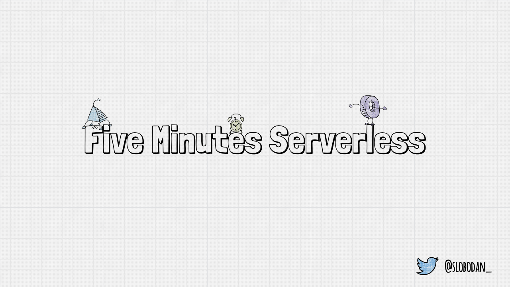
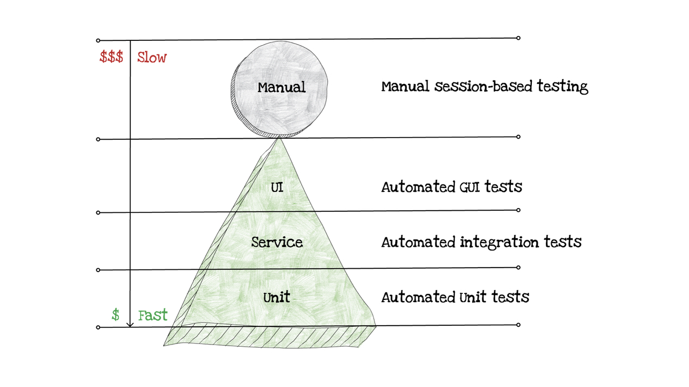

Welcome to Five Minutes Serverless!

---


In this episode, we talk about testing serverless applications.

---


---


Meet Alex!

He is a JavaScript developer, focused on Node.

---


(transition: crossfade 1)

---


Over the last couple of months, his good friends, Anna and Jeff, are always talking about that serverless thingy.

(transition: crossfade 1)

---

(voice: mario)


<speak>
  <emphasis level="strong">
    Mamma mia!
  </emphasis>
</speak>

---


Even though they are annoying from time to time, he likes the idea of serverless apps.

(transition: crossfade 1)

---


(transition: crossfade 1)

---


At some point, Alex and his team got a new project.

(transition: crossfade 1)

---


After some analysis, Alex thought that it would be the perfect fit for serverless.

They decided to give it a try. The project wasn’t too big, and the risk was low.

(transition: crossfade 1)

---


The team read about serverless, and they got an idea how to structure their new app.

But no one was sure how they should fit serverless into their common development process.

---


At that moment, their process looks like this:

First, they analyze a new feature.

For less complex features, they start with the code, then they run it locally and add some tests in the end.

For more complex features, they do their version of TDD: they start with tests, then write the code, and test it locally.

(pause: 1)

When the feature is ready, it goes to the C.I. tool that deploys it to the testing environment.

(pause: 1)

Then the QA team takes a new feature for another round of manual testing. If everything looks good, the app goes through C.I. to production.

---

(callout:
  type: rectangle
  left: 615
  top: 175
  right: 765
  bottom: 265)


The teams biggest challenge are automated tests.

(transition: crossfade 1)

---


(transition: crossfade 1)

Alex and his team just switched to Jest for testing their Node applications.

They still do a lot of front end, so they want to use the same tools for the full stack whenever they can.

Can they use Jest for testing serverless apps too?

---


After a quick investigation, they realized that they can use their favorite Node testing tools.

Jest, Jasmine, Mocha, and others work fine with serverless.

---


But, what should they test?

---



With their Node apps, Alex and his team follows the three-tier test automation pyramid.

As the test pyramid defines, they have:

---

(callout:
  type: rectangle
  left: 170
  top: 490
  right: 1000
  bottom: 615)


A lot of unit tests, because they are the cheapest, and fastest to write and run

---

(callout:
  type: rectangle
  left: 170
  top: 380
  right: 1100
  bottom: 510)


Fewer integration tests, because they are more expensive, and they take more time to run

---

(callout:
  type: rectangle
  left: 170
  top: 250
  right: 1000
  bottom: 405)


A few UI tests, because they are the most expensive. They requires some Graphic User Interface tool, and slowest to run

---

(callout:
  type: rectangle
  left: 170
  top: 65
  right: 1100
  bottom: 260)


Besides these, they also have manual session-based testing, done by their QA team.

---


How does serverless affect the test automation pyramid?

---


The serverless test pyramid looks less like the Egyptian, and more like the Mayan pyramids.

---

(callout:
  type: rectangle
  left: 170
  top: 490
  right: 990
  bottom: 610)


The unit tests layer is not affected a lot. Unit tests are still the cheapest to write and run.

---

(callout:
  type: rectangle
  left: 170
  top: 390
  right: 1090
  bottom: 505)


Integration tests layer becomes more important than ever, because serverless apps relies heavily on integrations.

It is also cheaper, because having a serverless database just for testing is cheap.

In a serverless “test pyramid” you need to have more integration tests.

---

(callout:
  type: rectangle
  left: 170
  top: 250
  right: 980
  bottom: 400)


UI tests layer is also cheaper and faster, because of cheaper parallelization.

---

(callout:
  type: rectangle
  left: 170
  top: 65
  right: 1100
  bottom: 260)


Manual testing layer stays the same.

---


Alex and his team finally had some idea where to focus.

The next problem was how to write a function to test them more easily.

---


You need to think about the following risks while you are writing a serverless function:

(pause: 1)

Configuration risks. For example, are the database and table correct? Or, do you have access rights?

(pause: 1)

Technical workflow risks. Are you parsing and using the incoming request as you should? Or, are you handling successful responses and errors correctly?

(pause: 1)

Business logic risks. Did you follow all the business logic rules that your application has?

(pause: 1)

Integration risks. Are you reading the incoming request structure correctly? Or are you storing the order to the database correctly?

(pause: 1)

To confirm that your serverless function is working as expected, you need to test all these risks.

---


To make the app more testable, the clear solution is to break up your function into several smaller ones.

One of the great ways to do so is applying Hexagonal Architecture to your serverless functions.

---


Hexagonal Architecture, or Ports and Adapters, allows an application to equally be driven by users, programs, automated test or batch scripts, and to be developed and tested in isolation from its eventual run-time devices and databases.

---


How to apply hexagonal architecture to your serverless functions?

(pause: 1)

Stay tuned for our next episode to see the practical example using AWS Lambda, Node, and Jest.

(pause: 5)

---

(font-size: 32)

```md
**Credits:**

- I built this video using Video Puppet
- I made diagrams using SimpleDiagrams 4
- Thanks to my friends Aleksandar (@simalexan) and Gojko (@gojkoadzic) for helping me with this video

The next episode will be released early next week!

Video by @slobodan_
```

Thanks for watching the second episode of Five Minutes Serverless!

(pause: 1)

Feel free to send me feedback or questions on twitter.

(duration: 8)

---


(duration: 5)