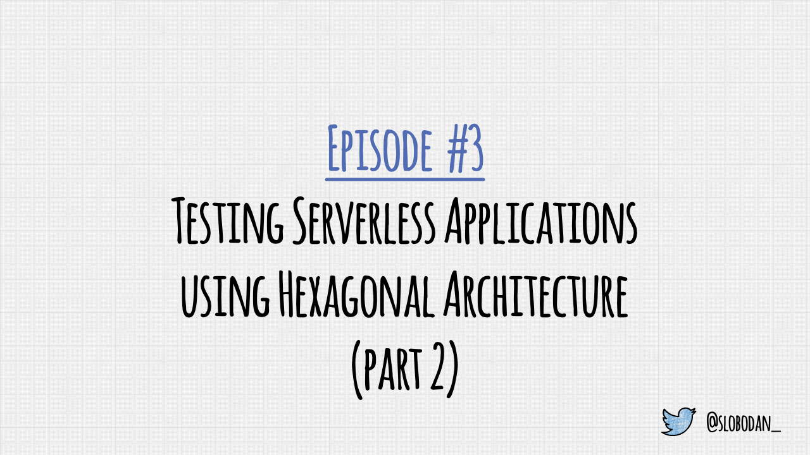
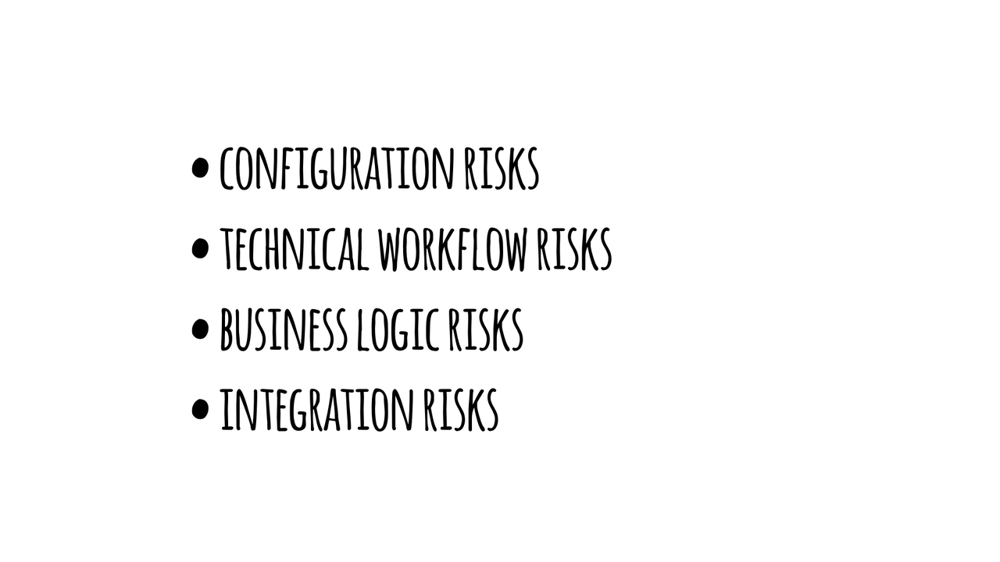
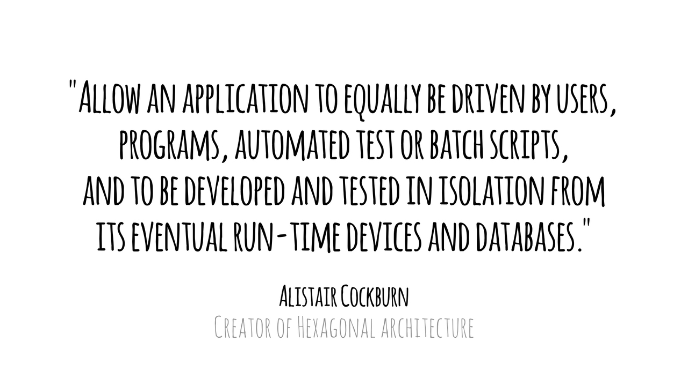
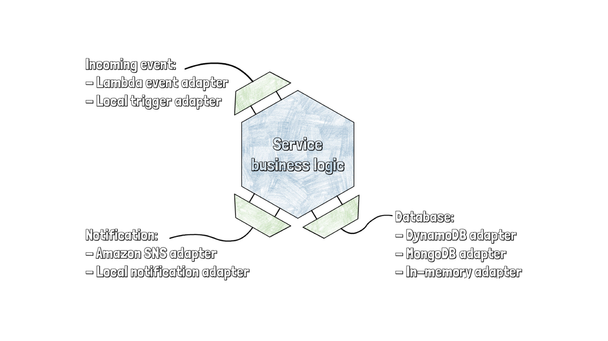
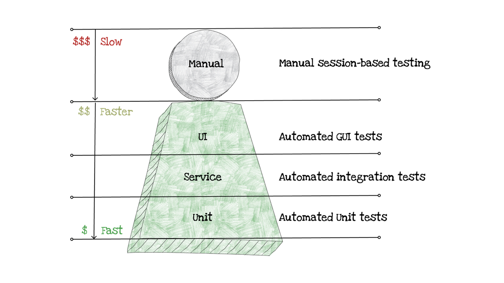
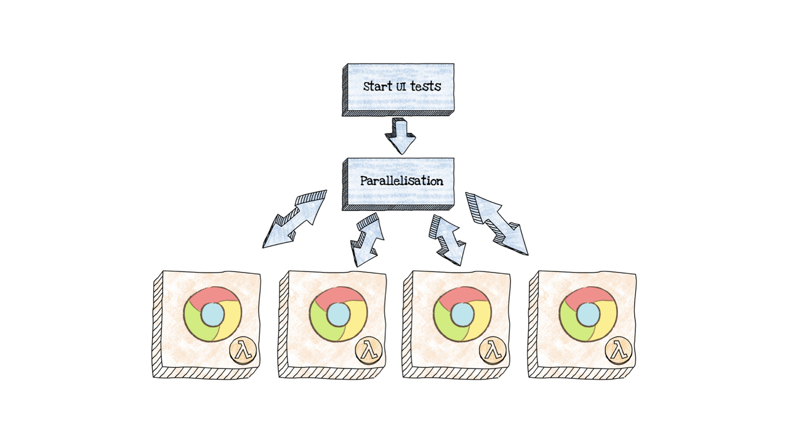
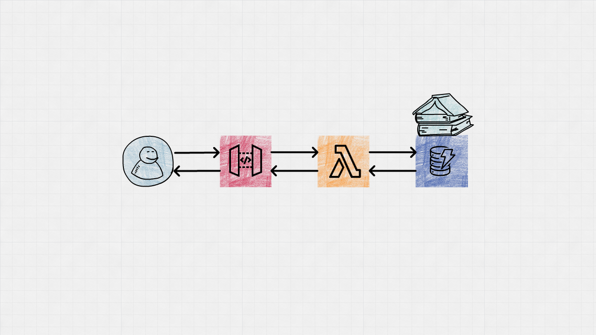
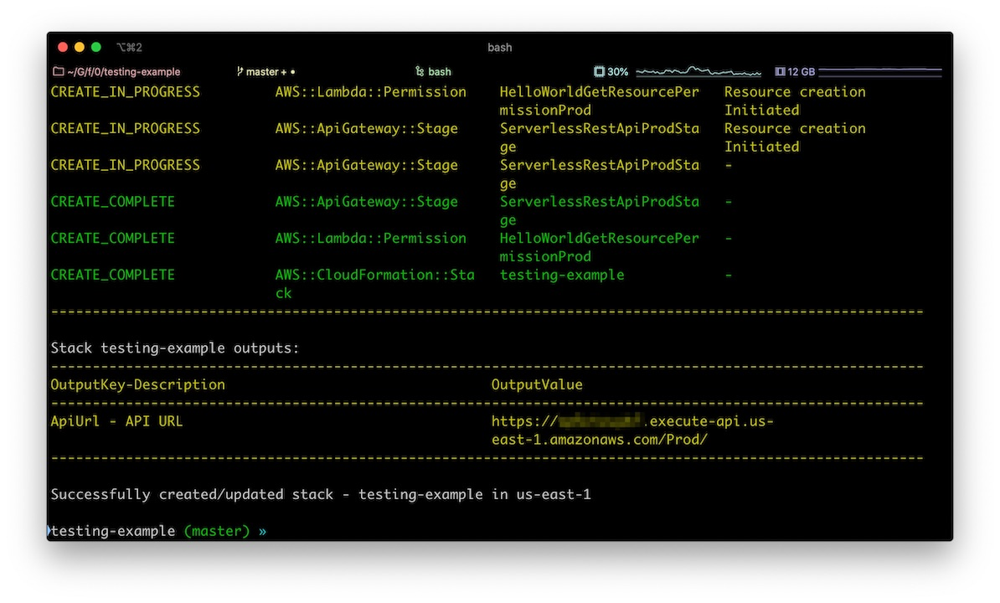

Welcome to Five Minutes Serverless!

---



In this episode, we talk about testing serverless applications using hexagonal architecture.

---



As we saw in the previous episode, when writing a serverless function, we need to think about configuration, technical workflow, business logic, and integration risks.

---


We need good architecture to handle them all.

---


One of the great ways to do so is applying Hexagonal Architecture, or Ports and Adapters, to our serverless functions.

---



Hexagonal Architecture allows an application to equally be driven by users, programs, automated test or batch scripts,

and to be developed and tested in isolation from its eventual run-time devices and databases.

Let's see how does that applies to our serverless functions.

---



Alex and his team use AWS, and they ended up with the following structure:

Function business logic exposes few "ports." For example, one for an incoming event, one for permanent storage, and one for notifications.

They have two adapters for the event that triggers a function, one for the real AWS Lambda trigger and another one for local testing.

They have several adapters for permanent storage and notifications, for example, DynamoDB table adapter and in-memory adapter.

---



Before we continue, let's go back to our serverless testing pyramid and see how this architecture affects all tiers.

---


(callout:
  type: rectangle
  left: 170
  top: 490
  right: 990
  bottom: 610)


Unit tests are the same, but easier to write. Alex can simply use a mock as an adapter to test the function business layer in isolation.

---

(callout:
  type: rectangle
  left: 170
  top: 390
  right: 1090
  bottom: 505)


Integration tests benefit a lot from Hexagonal Architecture. They were able to test integrations that they own thoroughly. Third-party integrations are simulated with other adapters.

---

(callout:
  type: rectangle
  left: 170
  top: 250
  right: 980
  bottom: 400)


As Alex and his team were building a back end for the app, the UI test tier was not relevant. However, they can use serverless to improve these tests, too.

---



UI tests are expensive and slow because they run in the browser. Serverless is cheap, and it scales fast.

Alex and his team can run a browser in AWS Lambda, to gain cheap parallelization and make their UI tests cheaper and faster.

---



Let's see the code example. We'll build a simple Books API with an API Gateway, Lambda, and DynamoDB table.

---

(font-size: 42)

```md
**Prerequisites:**

- An active AWS account
- AWS SAM installed
- Node.js version 8+ (version 12 is recommended)
```

Before we begin, make sure you have the following prerequisites.

You also need a basic knowledge of Node, Jest, and TypeScript.

---

```bash
mkdir testing-example
cd testing-example
```

Start by creating a new folder and navigating to it using your terminal. We'll call it "testing-example."

---

(font-size: 40)

```bash
sam init --location gh:serverlesspub/sam-ts
```

You can initialize an AWS SAM project the same way we did in the first episode.

Run the following command from your new folder using your terminal.

---


This command will create a new AWS SAM project with a Hello World function written in TypeScript.

---

(font-size: 40)

```yaml
GetBooks:
  Type: AWS::Serverless::Function
  Properties:
    CodeUri: build/get-books
    Handler: lambda.handler
    Events:
      GetResource:
        Type: Api
        Properties:
          Path: /books
          Method: GET
```

Open template.yaml file in your favorite code editor and replace Hello World function with the following GetBooks function.

Add an API event trigger with GET method and /books path.

---

(font-size: 21)

```yaml
Outputs:
  ApiUrl:
    Description: API URL
    Value: !Sub "https://${ServerlessRestApi}.execute-api.${AWS::Region}.amazonaws.com/Prod/"
```

Also, modify the outputs to output the API URL. ServerlessRestApi is an implicit API created by our Get Books function. SAM will deploy the Prod stage by default.

---

(font-size: 42)

```yaml
BooksTable:
  Type: AWS::DynamoDB::Table
  Properties: 
    AttributeDefinitions: 
      - AttributeName: "id"
        AttributeType: "S"
    KeySchema: 
      - AttributeName: "id"
        KeyType: "HASH"
    BillingMode: PAY_PER_REQUEST
```

Then add a DynamoDB table to the Resources section of your template file.

Books table can look similar to the following CloudFormation resource.

---

(font-size: 28)

```yaml
GetBooks:
  Type: AWS::Serverless::Function
  Properties:
    CodeUri: build/hello-world
    Handler: lambda.handler
    Policies:
      - DynamoDBReadPolicy:
          TableName: !Ref BooksTable
    Environment:
        Variables:
          TABLE_NAME: !Ref BooksTable
    Events:
      GetResource:
        Type: Api
        Properties:
          Path: /books
          Method: GET
```

Before we can write the code, pass a table name in an environment variable, and add a policy that allows your GetBooks function to read data from the database.

To do so, use the "DynamoDBReadPolicy" SAM Policy Template.

---

(font-size: 21)

```typescript
import { DocumentClient } from 'aws-sdk/clients/dynamodb'
const documentClient = new DocumentClient()

export interface IBook {
  id: string
  name: string
  authors: string[]
}

export class BooksDbRepository {
  public tableName: string
  public dc: DocumentClient

  constructor(tableName: string, dc = documentClient) {
    this.tableName = tableName
    this.dc = dc
  }

  public async get() {
    const params = {
      TableName: this.tableName
    };

    const result = await this.dc.scan(params).promise()

    return (result.Items as IBook[]) || []
  }
}
```

The infrastructure is ready. Let's add code.

Start with the Books database repository. Create the "common" folder in the source folder. Then create the "booksdb-repository.ts" file in that folder.

This file represents the Books database repository that will communicate with DynamoDB and should have the following content.

I think you should avoid scanning the DynamoDB table whenever you can, but we'll use "scan" in this video just to demonstrate how to test a function.

---

(font-size: 24)

```typescript
interface IBook {
  id: string
  name: string
  authors: string[]
}

import { BooksDbRepository } from '../../common/booksdb-repository'

export async  function getBooks(booksDb: BooksDbRepository): Promise<IBook[]> {
  return await booksDb.get()
}
```

Update the "main.ts" file in the "lib" folder of Get Books function to have the following content.

---

(font-size: 28)

```typescript
import { APIGatewayProxyResult } from 'aws-lambda'
import { getBooks } from './lib/main'
import { BooksDbRepository } from '../common/booksdb-repository'
```

Finally, update the "lambda.ts" file to import the following modules and types.

---

(font-size: 26)

```typescript
export async function handler(): Promise<APIGatewayProxyResult> {
  try {
    if (!process.env.TABLE_NAME) {
      throw new Error('TABLE_NAME environment variable is required')
    }
    const booksDb = new BooksDbRepository(process.env.TABLE_NAME)

    const books = await getBooks(booksDb)

    return {
      statusCode: 200,
      body: JSON.stringify(books)
    }
  } catch(err) {
    return {
      statusCode: 400,
      body: err.toString()
    }
  }
}
```

And update handler function to have the following content.

---

```bash
npm install
npm run build
sam deploy --guided
```

Build and deploy this project to confirm that everything works as expected. To do so, run the commands you see on your screen.

---



When the deployment finishes, SAM will output our API URL.

If you visit the URL with /books path in the end, it should return an empty array.

---


Now that our API is working let's switch to testing.

---

(font-size: 42)

```typescript
import { getBooks } from '../lib/main'

describe('Get Books', () => {
  describe('unit', () => {
    // Unit tests
  })

  describe('integration', () => {
    // Integration tests
  })
})
```

Open the "main.tests.ts" file of your Get Books function, and replace the content with the following code.

---

(font-size: 32)

```typescript
describe('unit', () => {
  test('should invoke BooksDb.get', async () => {
    const bookDbMock = {
      get: jest.fn(),
    }

    await getBooks(bookDbMock)

    expect(bookDbMock.get).toHaveBeenCalledTimes(1)
    expect(bookDbMock.get).toHaveBeenCalledWith()
  })
})
```

For unit tests, you can create a Jest Mock with the same interface and pass it to the Get Books function.

---

(font-size: 32)

```typescript
class LocalDb {
  private data: any[] = []

  // eslint-disable-next-line @typescript-eslint/require-await
  async get(): Promise<any[]> {
    return this.data
  }

  // eslint-disable-next-line @typescript-eslint/require-await
  async add(item: number): Promise<void> {
    this.data.push(item)
  }
}
```

For integrations tests, create a local database adapter, because we do not need to test each function against the DynamoDb table.

---

(font-size: 32)

```typescript
describe('integration', () => {
  test('should invoke BooksDb.get', async () => {
    const localDb = new LocalDb()

    localDb.add(1)
    localDb.add(2)
    localDb.add(3)
    const result = await getBooks(localDb)

    expect(result).toEqual([1, 2, 3])
  })
})
```

With a local database, integration tests are simple. Pass a Local Database Repository instead of Books DB Repository, and check the results.

---

```bash
npm t
```

Run the following command from your terminal to run your tests.

---

(font-size: 32)

```typescript
describe('integration', () => {
  beforeAll(async () => {
    // Create test DB
  })

  afterAll(async () => {
    // Destroy test DB
  })

  // Tests
})
```

Integration tests for Books Database repository are even more important, and slightly more complicated because we create the DynamoDB table at the beginning and destroy it at the end of the test suite.

---

(font-size: 24)

```typescript
beforeAll(async () => {
  const params = {
    AttributeDefinitions: [{
      AttributeName: 'id',
      AttributeType: 'S',
    }],
    KeySchema: [{
      AttributeName: 'id',
      KeyType: 'HASH',
    }],
    BillingMode: 'PAY_PER_REQUEST',
    TableName: tableName,
  }

  await dynamoDb.createTable(params).promise()

  await dynamoDb.waitFor('tableExists', {
    TableName: tableName,
  }).promise()
}, 60 * 1000)
```

We can create a DynamoDB table in the "beforeAll" section using the following code. Just keep in mind that creating can take some time, so increase the timeout to 60 seconds.

---

(font-size: 24)

```typescript
afterAll(async () => {
  await dynamoDb.deleteTable({
    TableName: tableName,
  }).promise()

  await dynamoDb.waitFor('tableNotExists', {
    TableName: tableName,
  }).promise()
}, 60 * 1000)
```

Destroy the table after the test suite is done with the following code.

---

```md
https://github.com/serverlesspub/five-minutes-serverless
```

The full example is available on the following Github repository.

(duration: 5)

---

(font-size: 32)

```md
**Credits:**

- I built this video using Video Puppet
- I made diagrams using SimpleDiagrams 4

For source code, visit the following repository:

[https://github.com/serverlesspub/five-minutes-serverless](https://github.com/serverlesspub/five-minutes-serverless)

Video by @slobodan_
```

Thanks for watching the first episode of Five Minutes Serverless!

(pause: 1)

Feel free to send me feedback or questions on twitter.

---


(duration: 4)
