Welcome to Five Minutes Serverless!

---

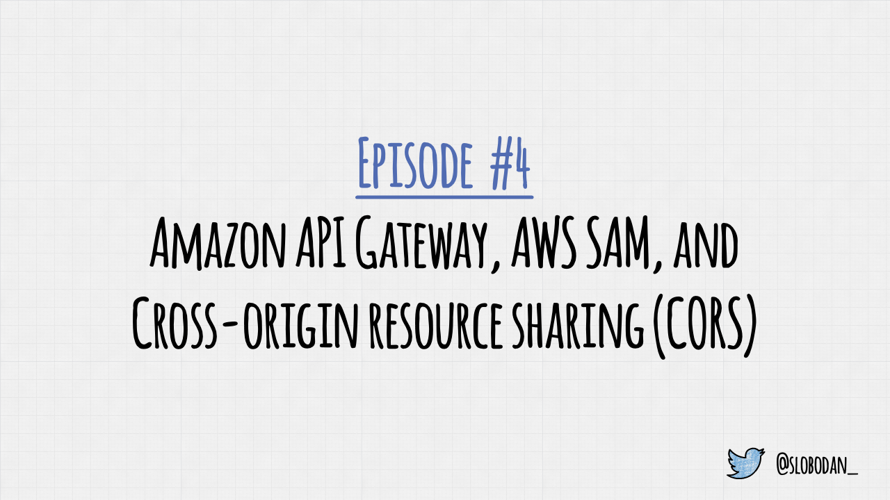

In this episode, we talk about the API Gateway, AWS SAM, and cross-origin resource sharing.

---

(voice: mario)


What's cross-origin resource sharing, and how does it work?

---


Cross-Origin Resource Sharing, or CORS, allows a web application on one domain to access resources from a different origin.

---

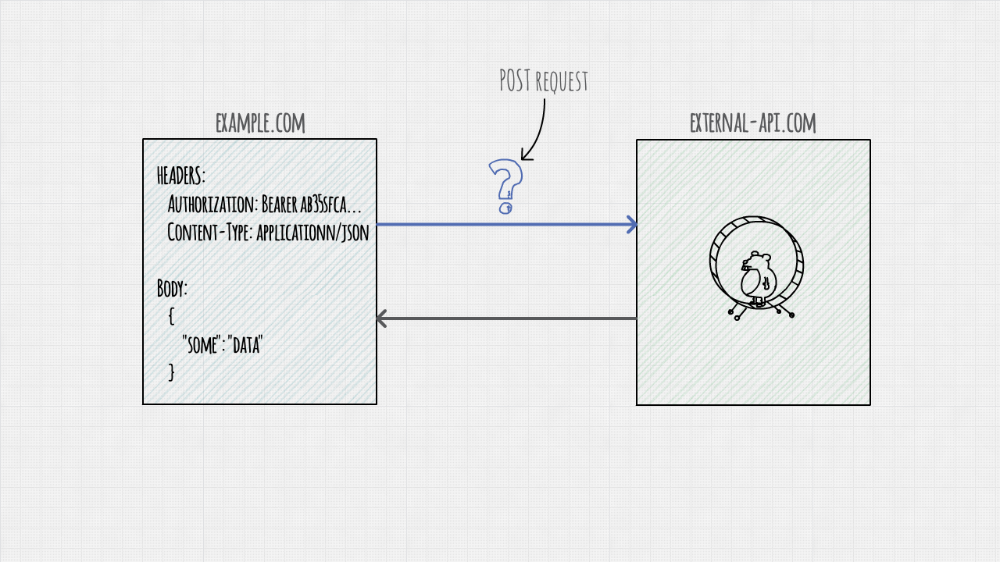

For example, if a web application sends a POST request from example.com to external-api.com, that's a cross-origin HTTP request.

---

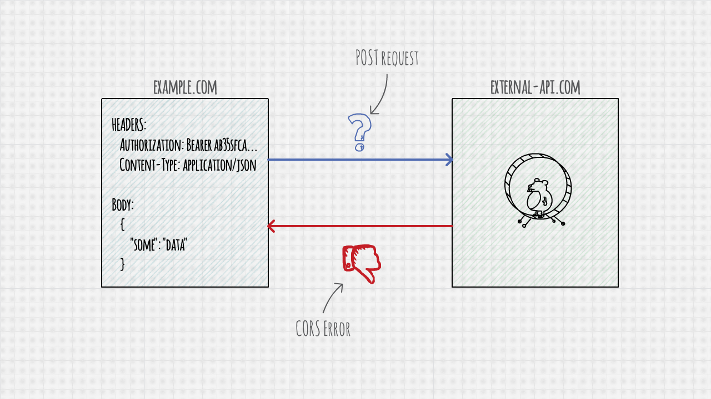

Normally, browsers would block these requests for security reasons.

---

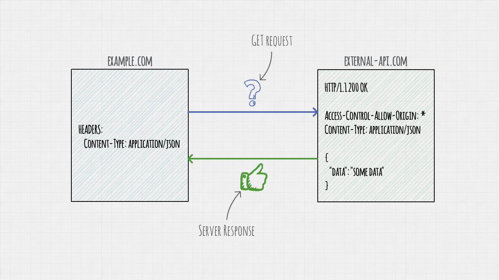

To allow these types of calls, the server needs to send CORS headers.

For simple GET requests, the server response needs to include the Access-Control-Allow-Origin header.

That could be a specific domain, or an * to allow open access.

---

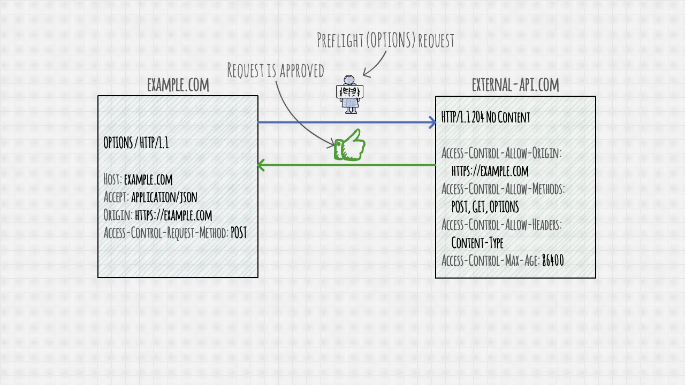

More complex calls require a "preflight" validation.

The browser first sends an OPTIONS request to check if the actual call is safe to send.

---

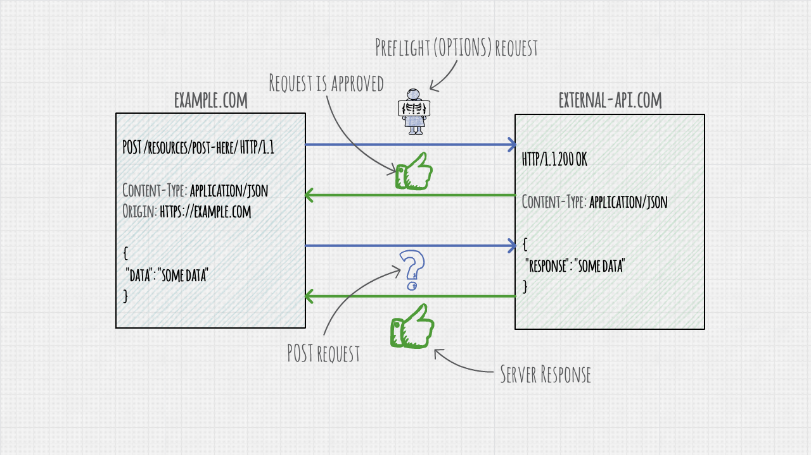

If the preflight validation succeeds, the browser sends the real request.

---

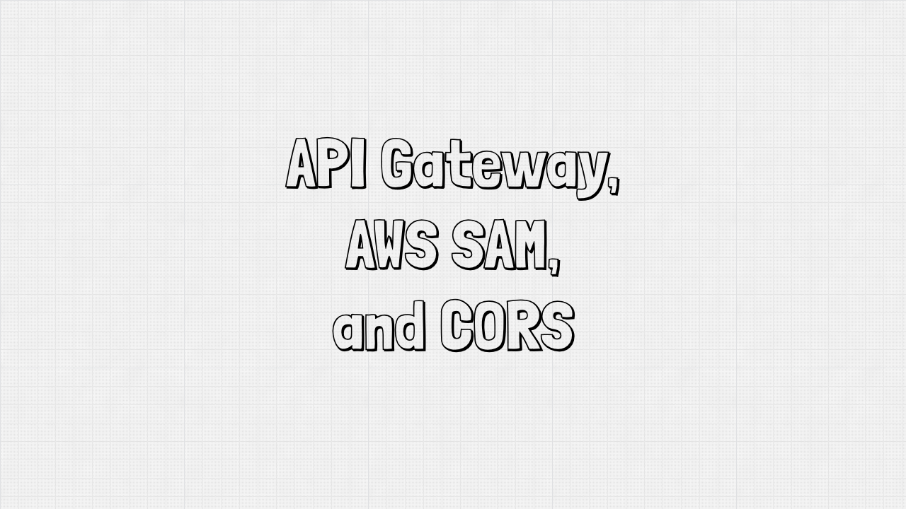

Amazon API Gateway and AWS SAM have full support for CORS.

Let's create a sample project and see how CORS works with SAM.

---

(font-size: 42)

```md
**Prerequisites:**

- An active AWS account
- AWS SAM installed
- Node.js version 8+ (version 12 is recommended)
```

Before we begin, make sure you have the following prerequisites.

You also need a basic knowledge of Node and TypeScript.

---

```bash
mkdir cors-example
cd cors-example
```

Start by creating a new folder and navigating to it using your terminal. We'll call it "cors-example."

---

(font-size: 40)

```bash
sam init --location gh:serverlesspub/sam-ts
```

You can initialize an AWS SAM project the same way we did in previous episodes.

Run the following command from your new folder using your terminal.

---

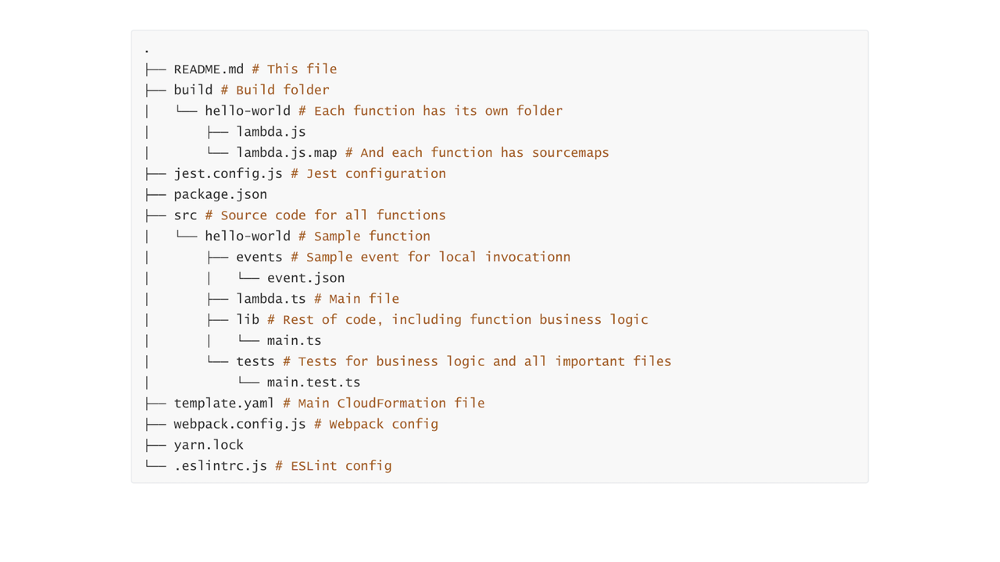

This command will create a new AWS SAM project with a Hello World function written in TypeScript.

---

(font-size: 32)

```yaml
HelloWorld:
  Type: AWS::Serverless::Function
  Properties:
    CodeUri: build/hello-world
    Handler: lambda.handler
    Events:
      PostResource:
        Type: Api
        Properties:
          Path: /
          Method: POST
```

Then open your template file and modify the HelloWorld function to add an API Gateway trigger.

---

(font-size: 22)

```yaml
ApiUrl:
  Description: An API URL
  Value: !<!Sub> 'https://${ServerlessRestApi}.execute-api.${AWS::Region}.amazonaws.com/Prod/'
```

Add an API URL to the Outputs section of your template file.

---

(font-size: 22)

```typescript
// Allow CloudWatch to read source maps
import 'source-map-support/register'

// You can import event types from @types/aws-lambda
import { APIGatewayProxyEvent, APIGatewayProxyResult } from 'aws-lambda'

export async function handler(event: APIGatewayProxyEvent): Promise<APIGatewayProxyResult> {
  try {
    const body = event.body ? JSON.parse(event.body) : {}
    const responseStatusCode = body.statusCode || 200
    const responseBody = body.response || {
      hello: 'world'
    }

    return {
      statusCode: responseStatusCode,
      body: JSON.stringify(responseBody)
    }
  } catch(err) {
    return {
      statusCode: 400,
      body: JSON.stringify({
        error: err.toString()
      })
    }
  }
}
```

Save the template, and modify the lambda.ts file of the Hello World function. This file is located in the source folder of our project.

In our handler function, we'll return a status code and body passed in the POST request body.

---

```bash
npm install
npm run build
sam deploy --guided
```

Build and deploy this project to confirm that everything works as expected. To do so, run the commands you see on your screen.

---

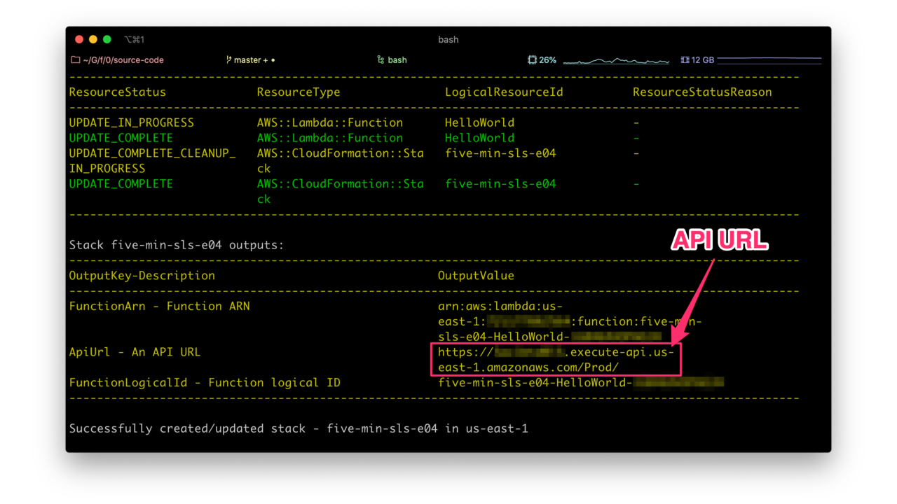

When the deployment finishes, SAM will output our API URL.

---

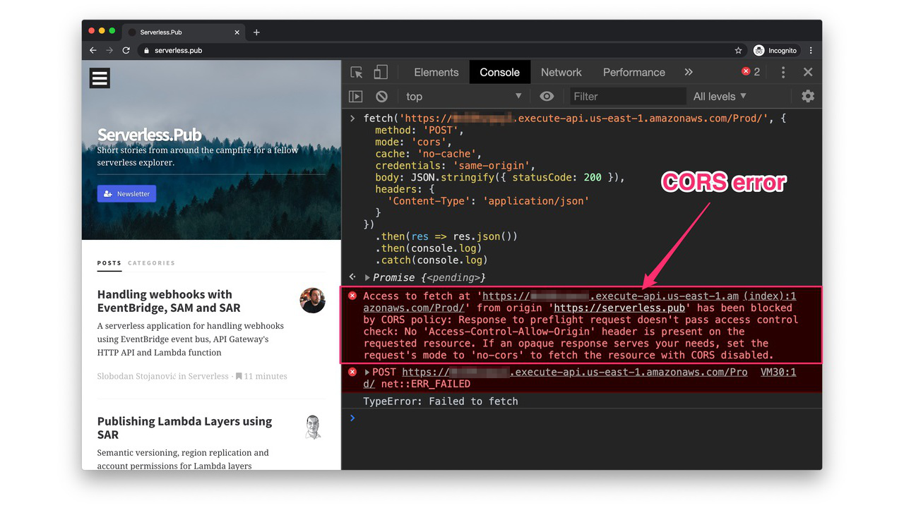

To test CORS, open your browser, visit any website, and open the developer tools.

Send a post request from the console using the fetch API, and you'll see the CORS error.

---

(font-size: 19)

```yaml
Api:
  Type: AWS::Serverless::Api
  Properties:
    StageName: prod
    Cors:
      AllowHeaders: "'Content-Type,Authorization,X-Amz-Date,X-Api-Key,X-Amz-Security-Token'"
      AllowOrigin: "'*'"
      MaxAge: "'3600'"
      AllowMethods: "'OPTIONS,POST,GET,PUT,DELETE'"
```

To enable CORS support, open your template file and replace the implicit Serverless Rest API in your template file, with the explicit AWS::Serverless::API resource.

Providing the stage name is required for the AWS Serverless API, you can name your stage "prod" or anything else you like.

---

(font-size: 32)

```yaml
HelloWorld:
  Type: AWS::Serverless::Function
  Properties:
    CodeUri: build/hello-world
    Handler: lambda.handler
    Events:
      PostResource:
        Type: Api
        Properties:
          Path: /
          Method: POST
          RestApiId: !Ref Api
```

Then update the Hello World function by referencing the new API with its trigger.

---

(font-size: 24)

```yaml
ApiUrl:
  Description: An API URL
  Value: !<!Sub> 'https://${Api}.execute-api.${AWS::Region}.amazonaws.com/prod/'
```

And update the outputs to print the new API URL.

---

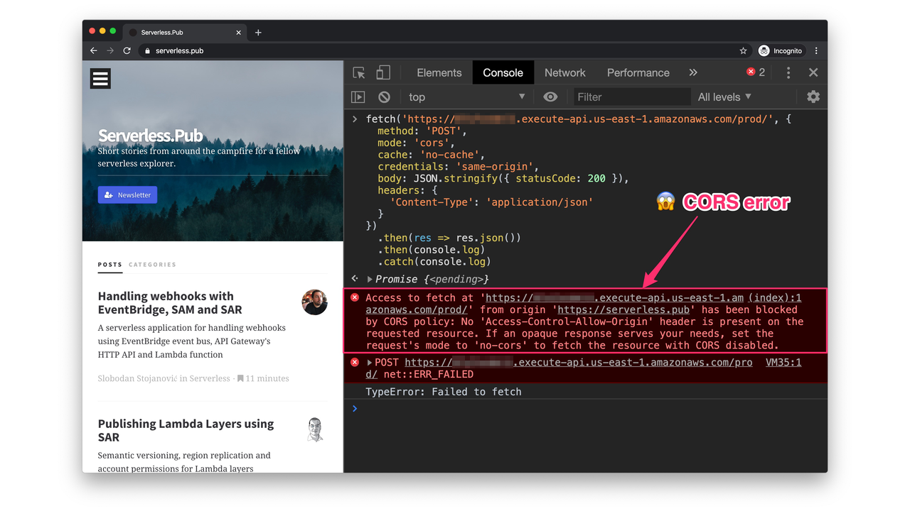

If you redeploy and test the app, you'll see the same CORS error in your browser.

To fix this problem, we need to add additional headers to the Hello World function response.

---

(font-size: 40)

```typescript
return {
  statusCode: responseStatusCode,
  headers: {
    'Access-Control-Allow-Origin': '*', 
    'Content-Type': 'application/json'
  },
  body: JSON.stringify(responseBody)
}
```

Open the lambda.ts file of Hello World function, and add headers to the object handler function returns.

The handler function needs to return access control allow origin header to enable the CORS support.

---

```bash
npm run build
sam deploy --guided
```

Build and deploy the project.

---

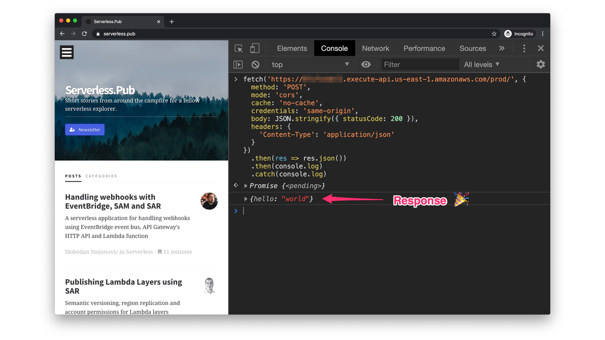

Then send the another HTTP request, and you'll see that it works now!

---

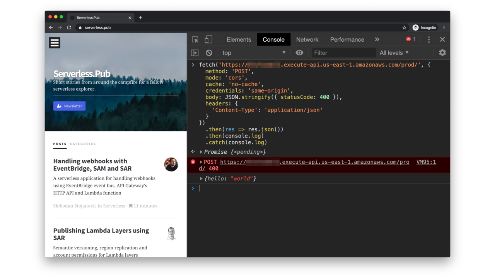

The CORS configuration will work even if you return the error status code from your Lambda function.

But will it work in case of unhandled errors?

---

(font-size: 21)

```typescript
// Allow CloudWatch to read source maps
import 'source-map-support/register'

// You can import event types from @types/aws-lambda
import { APIGatewayProxyEvent, APIGatewayProxyResult } from 'aws-lambda'

export async function handler(event: APIGatewayProxyEvent): Promise<APIGatewayProxyResult> {
  const body = event.body ? JSON.parse(event.body) : {}
  const responseStatusCode = body.statusCode || 200
  const responseBody = body.response || {
    hello: 'world'
  }

  if (responseStatusCode >= 400) {
    throw new Error(responseBody)
  }

  return {
    statusCode: responseStatusCode,
    headers: {
      'Access-Control-Allow-Origin': '*', 
      'Content-Type': 'application/json'
    },
    body: JSON.stringify(responseBody)
  }
}
```

Let's test this by updating the Hello World function to throw an error if the status code is 400 or larger.

---

```bash
npm run build
sam deploy --guided
```

Build and deploy the project again.

---

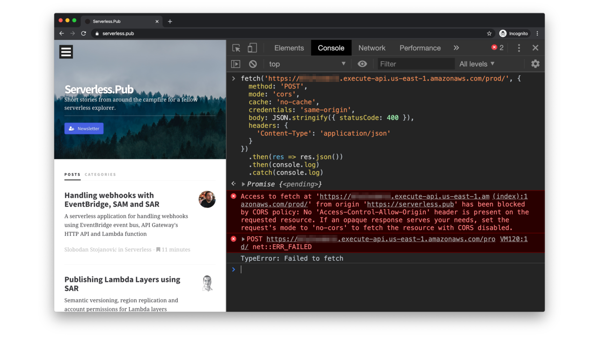

Send a request, and you'll see the good old CORS error.

By default, API Gateway adds CORS support for success calls only.

If functions or authorizers throw an error, your API will not add CORS headers to these responses.

---

(font-size: 20)

```yaml
Api:
  Type: AWS::Serverless::Api
  Properties:
    StageName: prod
    Cors:
      AllowHeaders: "'Content-Type,Authorization,X-Amz-Date,X-Api-Key,X-Amz-Security-Token'"
      AllowOrigin: "'*'"
      MaxAge: "'3600'"
      AllowMethods: "'OPTIONS,POST,GET,PUT,DELETE'"
    GatewayResponses:
      DEFAULT_4xx:
        ResponseParameters:
          Headers:
            Access-Control-Allow-Headers: "'Content-Type,Authorization,X-Amz-Date,X-Api-Key,X-Amz-Security-Token'"
            Access-Control-Allow-Origin: "'*'"
            Access-Control-Allow-Methods: "'OPTIONS,POST,GET,PUT,DELETE'"
      DEFAULT_5xx:
          ResponseParameters:
            Headers:
              Access-Control-Allow-Headers: "'Content-Type,Authorization,X-Amz-Date,X-Api-Key,X-Amz-Security-Token'"
              Access-Control-Allow-Origin: "'*'"
              Access-Control-Allow-Methods: "'OPTIONS,POST,GET,PUT,DELETE'"
```

To enable CORS for function and API errors, you need to add Gateway Responses to your API Gateway resource.

Open the template file and update your API with the following code.

Then redeploy your application and send another test request.

---


No more CORS error!

(pause: 2)

The Gateway Responses allow you to customize the response for different errors, such as ACCESS DENIED, AUTHORIZER FAILURE, and many others.

---

(font-size: 24)

```md
https://docs.aws.amazon.com/apigateway/latest/developerguide/supported-gateway-response-types.html
```

You can see the full list of Gateway Response types on the URL you see on the screen.

---

(font-size: 32)

```md
https://github.com/serverlesspub/five-minutes-serverless
```

The full example is available on the following Github repository.

(duration: 5)

---

(font-size: 32)

```md
**Credits:**

- I built this video using Video Puppet
- I made diagrams using SimpleDiagrams 4
- Thanks to my friends Aleksandar (@simalexan) and Gojko (@gojkoadzic) for helping me with this video

For source code, visit the following repository:

[https://github.com/serverlesspub/five-minutes-serverless](https://github.com/serverlesspub/five-minutes-serverless)

Video by @slobodan_
```

Thanks for watching the first episode of Five Minutes Serverless!

(pause: 1)

Feel free to send me feedback or questions on twitter.

---


(duration: 4)